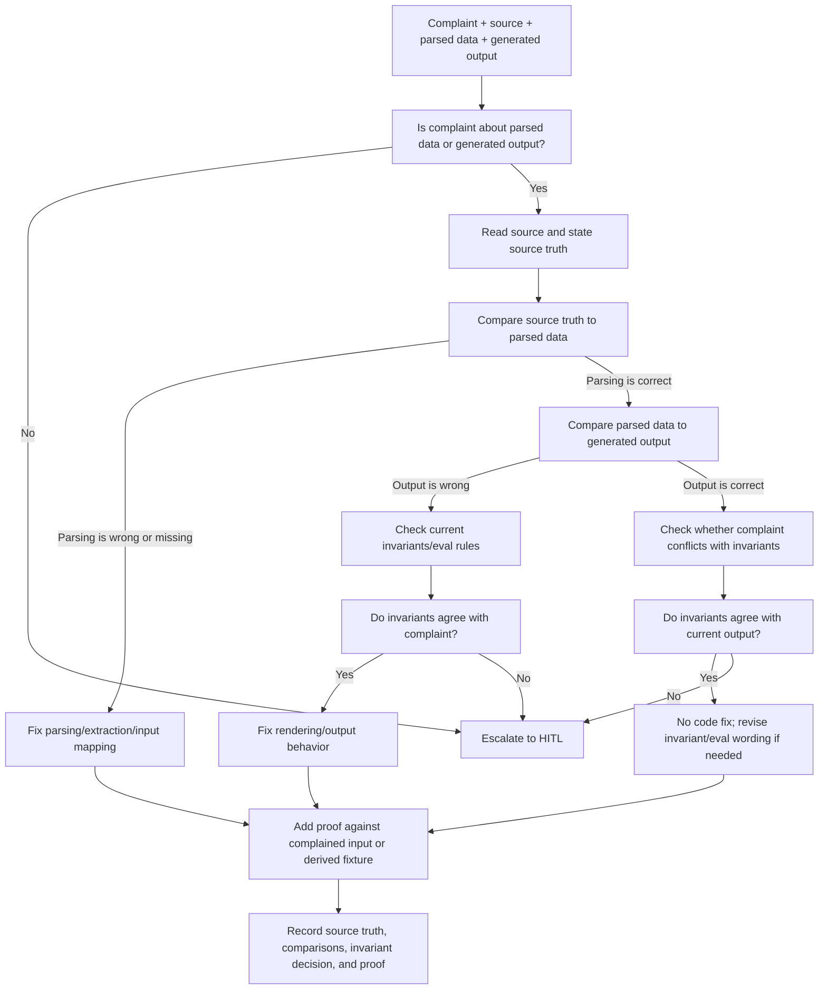

# Customer Feedback Triage

Start from the feedback issue and the artifacts it already provides: customer
complaint, source input, extracted or normalized data, generated output,
screenshots, and eval output if present. Do not turn this into a broad
evidence-gathering runbook. If a required artifact is missing, ask for that
artifact and stop.

## Flow

## Steps

1. Start with the complaint and attached artifacts.
2. Decide whether the complaint is actually about parsing/extraction or
   generated output. If not, escalate to HITL.
3. Read the source input and write one sentence that states source truth.
4. Compare source truth to the parsed data.
5. If parsing is wrong, fix the owning parser, prompt, schema, classification,
   field mapping, or input-normalization layer.
6. Whenever parsing changes, check the downstream transform and render/output
   pipeline end to end.
7. If parsing is right, compare the parsed data to the generated output.
8. If output is wrong, compare the complaint to the current product invariants,
   eval rules, or acceptance policy.
9. If the invariant agrees with the customer complaint, fix the output defect.
10. If the complaint conflicts with the invariant, escalate to HITL.
11. If the output is correct but the complaint or eval claim exposes confusing
    invariant language, revise the invariant or eval wording instead of
    changing code.
12. Add proof using the complained input or a fixture derived from it.
13. Record source truth, parsing comparison, output comparison, invariant
    decision, and fix/proof.

## Fix Rule

Only fix code when the path is clear:

- The complaint is about parsing/extraction or generated output.
- The source truth is clear.
- The parsing or output fault is identified.
- The current invariant agrees with the expected behavior.
- The fix can be scoped to the owning parser, transform, or rendering layer.
- Proof can be added for the complained input or derived fixture.
- If parsing changed, the associated transform/output pipeline has been checked
  end to end.

If any of those are not true, escalate to HITL with one concrete question.

source: agents
